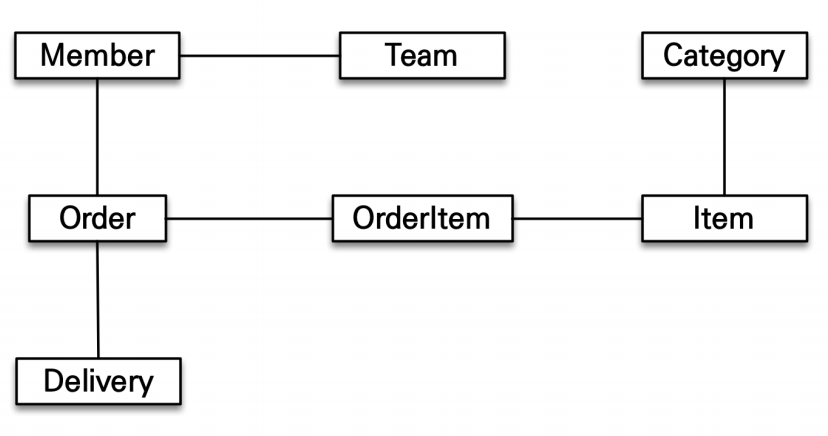
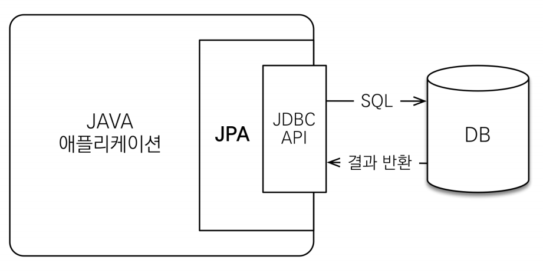
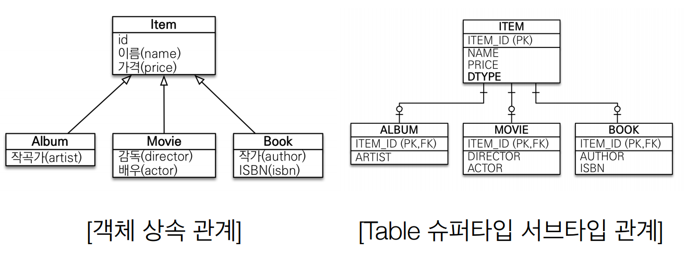

# 01장 JPA 소개

## 관계형 DB를 사용할 때 문제점
* (1) 객체와 관계형 DB의 패러다임이 다르다.
* (2) SQL에 종속적인 개발을 하게 된다.

## (1) 객체와 관계형 DB의 차이
> 객체와 관계형 DB의 패러다임이 다르다.
### 1. 상속관계
   * 객체에는 있지만 관계형 DB 에는 없음
   * table 수퍼타입 서브타입의 관계가 그나마 객체 상속 관계와 유사함
   * 상속 받은 객체를 테이블에 넣으려면 insert를 부모, 자식 2번 넣어야함
   * 조회 시 테이블을 join해서 가져온 후 자식에 데이터만 골라서 반환해줘야 함

### 2. 연관관계
   * 객체는 참조를 사용해서 get으로 불러오지만 관계형 DB는 foreign key를 이용해서 join
   * 객체의 참조는 단방향이지만 관계형 DB의 join은 양방향 접근이 가능함
     ```sql
     // (1) 외래키로 연관관계를 맺는 경우 
     class Member {
        String id; //MEMBER_ID 컬럼 사용
        Long teamId; //TEAM_ID FK 컬럼 사용
        String username;//USERNAME 컬럼 사용
     }
     class Team {
        Long id; //TEAM_ID PK 사용
        String name; //NAME 컬럼 사용
     }
     // 쿼리문 -- mybatis가 이런걸 잘 해줌, 하지만 객체의 느낌이 없음...
     insert into member(member_id, team_id, username) values...
     
     // (2) 객체로 연관관계를 맺는 경우
     class Member {
        String id; //MEMBER_ID 컬럼 사용
        Team team; //참조로 연관관계를 맺는다. //**
        String username;//USERNAME 컬럼 사용
      
        Team getTeam() {
           return team;
          }
     }
     class Team {
        Long id; //TEAM_ID PK 사용
        String name; //NAME 컬럼 사용
     }
     
     // 쿼리문 -- join으로 조회한 후 객체에 각각 할당하고 관계도 직접 설정해 줘야함
     SELECT M.*, T.*
     FROM MEMBER M
     JOIN TEAM T ON M.TEAM_ID = T.TEAM_ID
     
     public Member find(String memberId) {
        //SQL 실행 ...
        Member member = new Member();
        //데이터베이스에서 조회한 회원 관련 정보를 모두 입력
        Team team = new Team();
        //데이터베이스에서 조회한 팀 관련 정보를 모두 입력
     
        //회원과 팀 관계 설정
        member.setTeam(team); //**
        return member;
     }
     
     // 객체 모델링을 자바 컬렉션에 관리 -- 깔끔!
     list.add(member);
     Member member = list.get(memberId);
     Team team = member.getTeam();
     // 이걸 SQL에 매핑하는 순간 너무 복잡해져서 super dto를 만들고 한번에 때려넣게 됨
     ```

### 3. 데이터 타입
```
class MemberDAO {
 
 public Member getMember(String memberId) {
 String sql = "SELECT * FROM MEMBER WHERE MEMBER_ID = ?";
 ...
 //JDBC API, SQL 실행
 return new Member(...);
 }
}

// (1) SQL에서 조회
String memberId = "100";
Member member1 = memberDAO.getMember(memberId);
Member member2 = memberDAO.getMember(memberId);
member1 == member2; //다르다.

// (2) 자바 컬렉션에서 조회
String memberId = "100";
Member member1 = list.get(memberId);
Member member2 = list.get(memberId);
member1 == member2; //같다.
```
* 관계형 DB는 기본 키의 값으로 각 row를 비교한다.
* 객체는 identity(동일성, `==`)비교와 equality(동등성, `equals()`) 비교로 나뉜다.
* 기본 키 값이 같은 객체를 2번 조회했을 때 두 객체의 인스턴스는 다르다.
* 반면 컬렉션에 저장하게 되면 동일성 비교 시 동일한 인스턴스로 판단한다.

### 4. 데이터 식별 타입

## (2) 객체 계층 분할의 한계
> SQL을 사용하면 계층형 아키텍처에서 진정한 의미의 계층 분할이 어렵다.

#### 객체 그래프 탐색


* 객체는 자유롭게 객체 그래프를 탐색할 수 있어야 한다.
* 처음 작성한 SQL 쿼리에 의해 탐색 범위가 결정되어 버리므로 불가능 하다.
  
#### 엔티티의 신뢰 문제
```sql
SELECT M.*, T.*
 FROM MEMBER M
 JOIN TEAM T ON M.TEAM_ID = T.TEAM_ID 
member.getTeam(); //OK
member.getOrder(); //null
```
* 위 메소드를 마음 놓고 사용할 수 있는가? 이는 `엔티티의 신뢰 문제`로 이어진다.
* 어떤 쿼리를 통해 엔티티가 반환되었는지 직접 확인하기 전에는 사용할 수 없다. (논리적으로 연결된 layered entity)
* 그렇다고 모든 객체를 미리 로딩해 둘 수는 없다.
* memberDAO.getMember();, memberDAO.getMemberWithTeam(); 같은 대체 메소드를 작성하기도 한다.

# JPA
> Java Persistence API, 자바 ORM 표준
### ORM이란?
* Object-relational mapping (객체 관계 매핑)
* 객체와 관계형 DB는 각각 설계 후 ORM 프레임워크가 중간에서 매핑해줌

### 개요

* 어플리케이션과 JDBC 사이에서 동작
* JDBC API가 DB와 통신한다는 점은 동일하지만 개발자가 직접 안 해도 됨
* EJB 엔티티 빈 (자바 표준) -> 하이버네이트(오픈 소스) -> JPA(자바 표준)
* JPA는 인터페이스의 모음 (표준 명세), 하이버네이트 구현체를 쓰게 됨

### 버전
> 2.0 이상 쓰면 무리 없이 동작
* JPA 1.0(JSR 220) 2006년 : 초기 버전. 복합 키와 연관관계 기능이 부족
* JPA 2.0(JSR 317) 2009년 : 대부분의 ORM 기능을 포함, JPA Criteria 추가
* JPA 2.1(JSR 338) 2013년 : 스토어드 프로시저 접근, 컨버터(Converter), 엔티
  티 그래프 기능이 추가
  
## JPA를 써야 하는 이유
  
### (1) 생산성
* 저장: jpa.persist(member)
* 조회: Member member = jpa.find(memberId)
* 수정: member.setName("변경할 이름") -> update 쿼리 자동 생성
* 삭제: jpa.remove(member)
-> 자바 컬렉션에 데이터를 넣고 빼는 것처럼 느껴지도록 쿼리 작업을 대신 해줌
  
### (2) 유지보수성
* 기존에는 필드 변경 시 모든 SQL을 수정해야 했다.
* JPA에서는 필드만 추가하면 된다.

### (3) 객체와 SQL 패러다임의 불일치 해결

```
// 저장을 위해 개발자가 할일
jpa.persist(album);
// 저장을 위해 JPA가 하는 일
INSERT INTO ITEM ...
INSERT INTO ALBUM ...

// 조회를 위해 개발자가 할일
Album album = jpa.find(Album.class, albumId);
// 조회를 위해 JPA가 하는 일
SELECT I.*, A.*
 FROM ITEM I
 JOIN ALBUM A ON I.ITEM_ID = A.ITEM_ID
```

### (4) 연관관계와 객체 그래프 탐색
```
// 연관 관계
member.setTeam(team);
jpa.persist(member);

// 객체 그래프 탐색
Member member = jpa.find(Member.class, memberId);
Team team = member.getTeam();
```

### (5) 신뢰할 수 있는 엔티티, 계층
```
class MemberService {
 ...
 public void process() {
 Member member = memberDAO.find(memberId);
 member.getTeam(); //자유로운 객체 그래프 탐색
 member.getOrder().getDelivery();
 }
}
```
* jpa를 통해서 member 객체를 가져온 경우 객체 자유롭게 탐색 가능
* `지연 로딩`은 실제 조회를 사용하는 시점에 sql이 나가서 데이터가 채워지기 때문
* 즉 jpa를 통해 가져온 객체를 신뢰할 수 있는 것

### (6) 타입 비교하기
```
String memberId = "100";
Member member1 = jpa.find(Member.class, memberId);
Member member2 = jpa.find(Member.class, memberId);
member1 == member2; //같다.
```
* 동일한 트랜잭션에서 조회한 엔티티는 같음을 보장한다.

## JPA의 성능 최적화 기능

* 중간 계층이 있으면 버퍼링에 모아서 한번에 쏘거나 캐싱이 가능함
* 즉 잘 활용하기만 하면 jpa를 쓰는 것이 더 성능이 좋아짐

### (1) 1차 캐시와 동일성(identity) 보장
* 같은 트랜잭션 안에서는 같은 엔티티를 반환 - 약간의 조회 성능 향상
* db isolation level이 read commit이어도 애플리케이션에서 repeatable read를 보장
* 한 트랜잭션 안에서만 유효하므로 대단한 성능 향상을 기대하기는 어려움
```
// sql이 한 번만 실행
String memberId = "100";
Member m1 = jpa.find(Member.class, memberId); //SQL
Member m2 = jpa.find(Member.class, memberId); //캐시
println(m1 == m2) //true
```

### (2) 트랜잭션을 지원하는 쓰기 지연(transactional write-behind)
* 트랜잭션을 커밋할 때까지 INSERT SQL을 모음
* `JDBC BATCH` SQL 기능을 사용해서 한번에 SQL 전송이 가능하지만 코드가 정말 지저분해짐
* jpa는 트랜잭션 안에 넣어서 한번에 네트워크를 통해서 보내게 됨
```
transaction.begin(); // 트랜잭션 시작
em.persist(memberA);
em.persist(memberB);
em.persist(memberC);
//여기까지 INSERT SQL을 데이터베이스에 보내지 않는다.
//커밋하는 순간 데이터베이스에 INSERT SQL을 모아서 보낸다.
transaction.commit(); // 트랜잭션 커밋
```

* UPDATE, DELETE로 인한 로우(ROW)락 시간 최소화
* 트랜잭션 커밋 시 UPDATE, DELETE SQL 실행하고, 바로 커밋
```
transaction.begin(); // 트랜잭션 시작
changeMember(memberA); 
deleteMember(memberB); 
비즈니스_로직_수행(); //비즈니스 로직 수행 동안 DB 로우 락이 걸리지 않는다. 
//커밋하는 순간 데이터베이스에 UPDATE, DELETE SQL을 보낸다.
transaction.commit(); // 트랜잭션 커밋
```

### (3) 지연 로딩 (lazy loading)
```
// 지연 로딩: 객체가 실제 사용될 때 로딩
Member member = memberDAO.find(memberId); -> SELECT * FROM MEMBER
Team team = member.getTeam();
String teamName = team.getName(); -> SELECT * FROM TEAM

// 즉시 로딩: join sql로 한번에 연관된 객체까지 미리 조회
Member member = memberDAO.find(memberId); -> SELECT M.*, T.* FROM MEMBER JOIN TEAM …
Team team = member.getTeam();
String teamName = team.getName();
```
* 같이 가져오는 객체를 한번에 가져와서 로딩된 데이터를 쓰도록 옵션 설정 가능
* 지연 로딩과 즉시 로딩을 상황에 따라 번갈아 가며 사용 가능함
* 처음에 지연 로딩으로 쭉 짜고 최적화 하면서 일부를 즉시 로딩으로 수정하면 효과적