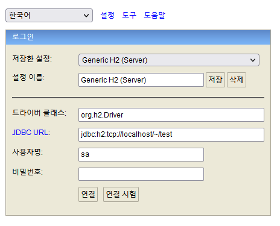
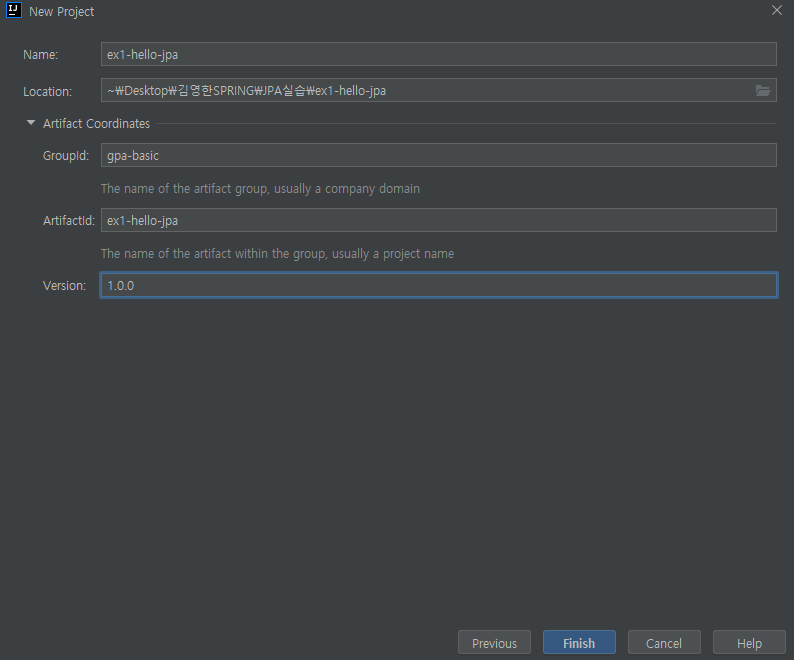
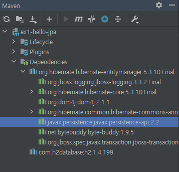
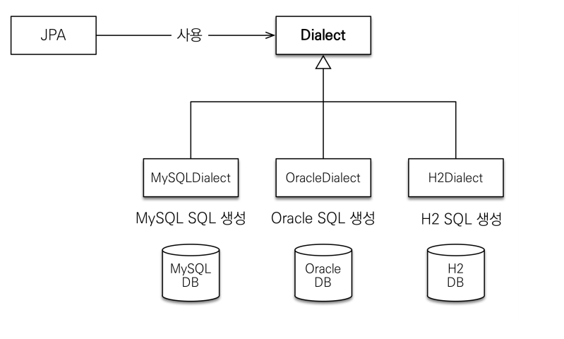
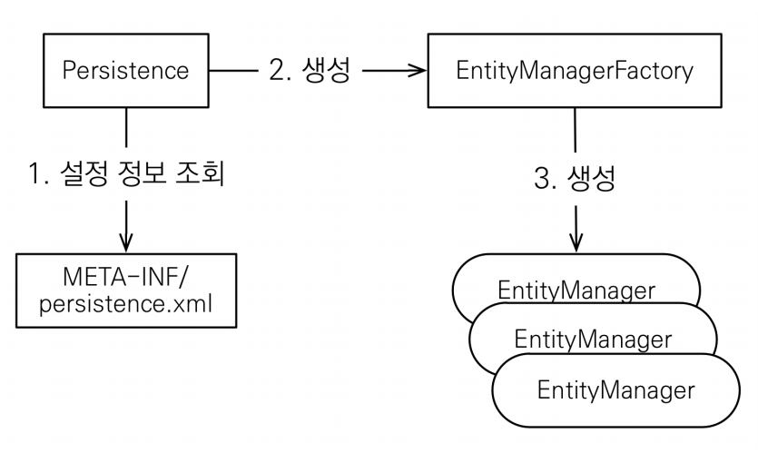
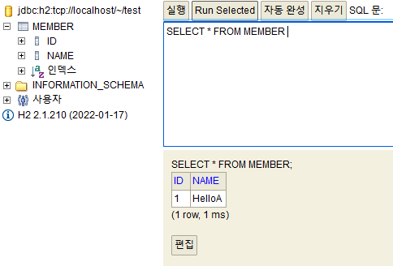

# 02장 JPA 시작

## 1. H2 데이터베이스 설치와 실행
* 다운로드 링크: http://www.h2database.com/
* 웹용 쿼리툴을 제공하며 가벼운 실습용 데이터베이스
* MySQL, Oracle과 유사한 쿼리를 날려 시뮬레이션 가능
* 시퀀스, AUTO INCREMENT를 모두 지원
* DB를 띄우지 않고 메모리에서 간단히 실행 가능


* H2 console에서 server로 접속

## 2. 메이븐 설치
* 다운로드 링크: http://maven.apache.org/
* 자바 라이브러리, 빌드 관리  
* 강사님은 gradle을 더 많이 사용한다고 하심
* java 8 이상 사용을 권장


* maven 프로젝트 생성
* 지금은 순수 jpa 실습이지만 향후 spring 프레임워크와 통합할 예정
* 따라서 spring boot 버전에 맞는 하이버네이트 버전을 설치할 것


* jpa의 구현체로 하이퍼네이트를 선택
* 하이버네이트 엔티티매니저에 필요한 jpa 라이브러리가 연결

### (1) pom.xml 파일 작성

```xml
<?xml version="1.0" encoding="UTF-8"?>
<project xmlns="http://maven.apache.org/POM/4.0.0"
         xmlns:xsi="http://www.w3.org/2001/XMLSchema-instance"
         xsi:schemaLocation="http://maven.apache.org/POM/4.0.0 http://maven.apache.org/xsd/maven-4.0.0.xsd">
    <modelVersion>4.0.0</modelVersion>

    <groupId>gpa-basic</groupId>
    <artifactId>ex1-hello-jpa</artifactId>
    <version>1.0.0</version>

    <dependencies>
        <!-- JPA 하이버네이트 -->
        <dependency>
            <groupId>org.hibernate</groupId> // maven에 명시된 하이버네이트 라이브러리
            <artifactId>hibernate-entitymanager</artifactId>
            <version>5.3.10.Final</version> // spring boot 버전과 맞춰줌
        </dependency>

        <!-- H2 데이터베이스 -->
        <dependency>
            <groupId>com.h2database</groupId>
            <artifactId>h2</artifactId>
            <version>1.4.199</version> // 다운로드 받은 h2 데이터베이스 버전과 맞추기
        </dependency>

    </dependencies>

    <properties>
        <maven.compiler.source>8</maven.compiler.source>
        <maven.compiler.target>8</maven.compiler.target>
    </properties>

</project>
```

### (2) persistense.xml 파일 생성
* `src/main/resources` 아래에 `meta-inf` 폴더 만든 후 `persistence.xml` 생성
* 정해진 규약이므로 반드시 지킬 것
```xml
<?xml version="1.0" encoding="UTF-8"?> 
<persistence version="2.2"> //jpa2.2를 사용한다는 뜻
 xmlns="http://xmlns.jcp.org/xml/ns/persistence" xmlns:xsi="http://www.w3.org/2001/XMLSchema-instance" 
 xsi:schemaLocation="http://xmlns.jcp.org/xml/ns/persistence http://xmlns.jcp.org/xml/ns/persistence/persistence_2_2.xsd"> 
 <persistence-unit name="hello"> // jpa 이름을 만드는 것 (현재는 데이터베이스가 1개)
 <properties> 
 <!-- 필수 속성 --> 
 <property name="javax.persistence.jdbc.driver" value="org.h2.Driver"/>
 <property name="javax.persistence.jdbc.user" value="sa"/> // h2 콘솔(localhost:8082)에 입력했던 데이터베이스 접근 정보
 <property name="javax.persistence.jdbc.password" value=""/> // h2 콘솔(localhost:8082)에 입력했던 데이터베이스 접근 정보
 <property name="javax.persistence.jdbc.url" value="jdbc:h2:tcp://localhost/~/test"/> // h2 콘솔(localhost:8082)에 입력했던 데이터베이스 접근 정보
 <property name="hibernate.dialect" value="org.hibernate.dialect.H2Dialect"/> // 하이버네이트 전용 속성
 
 <!-- 옵션 --> 
 <property name="hibernate.show_sql" value="true"/> // 디비에 나가는 쿼리를 볼 수 있는 옵션
 <property name="hibernate.format_sql" value="true"/> 
 <property name="hibernate.use_sql_comments" value="true"/> 
 <!--<property name="hibernate.hbm2ddl.auto" value="create" />--> 
 </properties> 
 </persistence-unit> 
</persistence> 
```
#### javax.persistence
* javax.persistence는 jpa 표준 자체
* 하이버네이트는 jpa의 구현체
* 따라서 하이버네이트가 아닌 다른 구현체를 선택해도 javax.persistence 속성은 동일하게 작성해야 함


#### 하이버네이트 전용 속성
* JPA는 특정 데이터베이스에 종속적이지 않도록 설계되었음
* 즉 MySQL을 사용하다가 Oracle로 바꾸려고 해도 무리가 없어야 함 (이론적으로
* 실제로는 각 데이터베이스가 제공하는 SQL 문법과 함수가 조금씩 다름
* 각 데이터베이스에서 표준적이지 않은 고유한 기능을 `방언`이라고 표현함
  * 가변 문자: MySQL은 VARCHAR, Oracle은 VARCHAR2
  * 문자열을 자르는 함수: SQL 표준은 SUBSTRING(), Oracle은
  SUBSTR()
  * 페이징: MySQL은 LIMIT , Oracle은 ROWNUM
* 각 데이터베이스마다 `벤더이름+방언`을 속성값으로 연결
```xml
// h2 데이터베이스
<property name="hibernate.dialect" value="org.hibernate.dialect.H2Dialect"/> 
// MySQL 데이터베이스 (요즘에는 이노디비를 안써도 된다고 함)
<property name="hibernate.dialect" value="org.hibernate.dialect.MySQL5Dialect"/> 
// Oracle 데이터베이스
<property name="hibernate.dialect" value="org.hibernate.dialect.Oracle12cDialect"/>

```
* 필요시 만들어서 커스터마이징 할 수 있음
* 하이버네이트는 40개 이상의 데이터베이스 방언 지원

## 3. JPA 구동방식

* persistence 클래스가 persistence.xml 설정정보를 읽어서 EntityManagerFactory 라는 클래스를 생성
* EntityManagerFactory에서 EntityManager를 복수개 만들어내서 사용

### 스켈레톤 코드
* src/main/java 아래에 hellojpa 패키지 생성
* JpaMain.java 클래스 생성

```java
package hellojpa;

import javax.persistence.EntityManager;
import javax.persistence.EntityManagerFactory;
import javax.persistence.Persistence;

public class JpaMain {

    public static void main(String[] args){
        // EntityManagerFactory를 hello라는 unit 이름으로 생성
        // 데이터베이스와 자동으로 연결
        EntityManagerFactory emf = Persistence.createEntityManagerFactory("hello");

        EntityManager em = emf.createEntityManager();
        // code
        em.close();
        emf.close();
    }
}
```
## 4. h2 데이터베이스 연결

### Member 테이블 생성 (h2)
```sql
create table Member ( 
 id bigint not null, 
 name varchar(255), 
 primary key (id) 
);
```

### Member 클래스 생성
* `@Entity` 어노테이션 붙여서 Member 클래스 생성
* `@Id` 어노케이션 붙여서 pk 설정 후 id와 name 필드 만들기
* getter and setter 만들기 (generator 단축키: `alt+ins`)
```java
@Entity
public class Member {

    // pk
    @Id
    private Long id;
    private String name;

    public Long getId() {
        return id;
    }

    public void setId(Long id) {
        this.id = id;
    }

    public String getName() {
        return name;
    }

    public void setName(String name) {
        this.name = name;
    }
}
```

### Table 생성
```java
package hellojpa;

import javax.persistence.EntityManager;
import javax.persistence.EntityManagerFactory;
import javax.persistence.EntityTransaction;
import javax.persistence.Persistence;

public class JpaMain {

    public static void main(String[] args){
        // EntityManagerFactory를 hello라는 unit 이름으로 생성
        // 데이터베이스와 자동으로 연결
        // EntityManagerFactory는 애플리케이션 로딩 시점에 1개만 생성
        EntityManagerFactory emf = Persistence.createEntityManagerFactory("hello");

        // 데이터베이스 커넥션되고 트랜잭션이 생성~종료될 때마다 EntityManager 하나씩 생성
        EntityManager em = emf.createEntityManager();

        EntityTransaction tx = em.getTransaction();
        tx.begin();

        try {
            Member member = new Member();
            member.setId(1L);
            member.setName("HelloA");

            em.persist(member);
            tx.commit();
        } catch (Exception e) {
            tx.rollback();
        } finally {
            // 엔티티매니저가 내부적으로 데이터커넥션을 물고 있으므로 사용 후 반드시 닫아줘야 함
            em.close();
        }
        // 전체 어플리케이션이 종료되면 엔티티매니저팩토리까지 종료
        emf.close();
    }
}

```
* try, catch로 트랜잭션 관리하는 정석 코드 (spring을 쓰면 알아서 해줌)
* 위 코드 실행 시 출력 로그
* Member가 생성됐다는 주석 후 쿼리 보여줌
* persistence.xml에서 준 옵션과 관련 있음
  * `show_sql` : 로그 출력 on
  * `format_sql` :  sql 형태로 포맷팅해서 출력
  * `use_sql_comments` : 쿼리가 왜 나왔는지 이유를 주석으로 출력
```
Hibernate: 
    /* insert hellojpa.Member
        */ insert 
        into
            Member
            (name, id) 
        values
            (?, ?)
```
* 쿼리 실행 결과는 h2 콘솔에서 확인

* 쿼리를 직접 작성하지 않았지만 JPA가 Member 클래스를 보고 관습적으로 쿼리 생성
* `@Table(name="USER")` 으로 테이블 직접 지정 가능
* `@Column(name="username` 으로 컬럼 직접 지정 가능
* 즉 어노테이션으로 커스터마이징하여 매핑 가능

### 값 불러오기
```java
try {
            Member findMember = em.find(Member.class, 1L);
            System.out.println("findMember.id = " + findMember.getId());
            System.out.println("findMember.id = " + findMember.getName());

            tx.commit();
        }
```
실행 결과
```
Hibernate: 
    select
        member0_.id as id1_0_0_,
        member0_.name as name2_0_0_ 
    from
        Member member0_ 
    where
        member0_.id=?
findMember.id = 1
findMember.id = HelloA
```

### 값 삭제
```jql
// 삭제
            em.remove(findMember);
```

### 값 수정
```jql
// 수정
            findMember.setName("HelloJPA");
```
* java 객체에서 값만 바꾸고 따로 persist를 해주지 않아도 됨

실행 결과
```jql
Hibernate: 
    select
        member0_.id as id1_0_0_,
        member0_.name as name2_0_0_ 
    from
        Member member0_ 
    where
        member0_.id=?
Hibernate: 
    /* update
        hellojpa.Member */ update
            Member 
        set
            name=? 
        where
            id=?
```

## 5. 주의
* 엔티티매니저팩토리는 DB 당 1개만 생성
* 엔티티매니저는 고객의 요청이 올때마다 열었다가 닫아야 함
* 엔티티매니저는 **쓰레드 간 공유를 하면 안 된다**
* JPA의 모든 데이터는 **트랜잭션 안에서** 실행해야 한다
* RDB는 트랜잭션 단위로 처리되므로 지켜줘야 한다
* 단순 조회는 트랜잭션 선언 안 해도 돌아간다.

## 6. JPQL 소개
* 가장 단순한 조회 방법은 EntityManager.find() 이나 객체 그래프 탐색 ( a.getB().getC() )
* 현업에서 복잡한 이슈: 나이가 18살 이상인 회원을 모두 검색하고 싶다면?
* 객체를 대상으로 하는 객체 지향 쿼리 JPQL를 사용! 

```jql
// JPQL 실습
// JPA에서는 테이블 대상으로 코드를 짜지 않음, Member 객체를 대상으로 쿼리를 함
List<Member> result = em.createQuery("select m from Member as m", Member.class).getResultList();
for (Member member : result ){
    System.out.println("member.name = " + member.getName());
}
```
실행결과
```jql
Hibernate: 
    /* select
        m 
    from
        Member as m */ select
            member0_.id as id1_0_,
            member0_.name as name2_0_ 
        from
            Member member0_
member.name = HelloJPA
```
* jpql은 주석에 적혀 있음 -> Member 엔티티를 선택
* 실제로 날아간 쿼리를 보면 select 후 필드를 다 작성
* 어떤 메리트가 있냐? 페이지네이션을 할 수 있음 (limit와 offset이 자동 반영)
* JPQL을 작성하면 각 데이터베이스의 dialect에 맞게 자동으로 쿼리 생성해 줌

### JPA 사용 시 단점
* JPA를 사용하면 엔티티 객체를 중심으로 개발
* 문제는 검색 쿼리
* 검색을 할 때도 테이블이 아닌 엔티티 객체를 대상으로 검색
* 모든 DB 데이터를 객체로 변환해서 검색하는 것은 불가능
* 어플리케이션이 필요한 데이터만 DB에서 불러오려면 결국 검색 조건이 포함된 SQL이 필요

> 물리적인 RDB를 대상으로 쿼리를 하면 데이터베이스에 종속되므로, 엔티티를 대상으로 쿼리할 수 있는 JPQL을

### JPQL
> JPA는 SQL을 추상화한 JPQL이라는 객체 지향 쿼리 언어를 제공
* SQL 문법과 유사 (select, from, where, group by, having, join 지원)
* jpql은 `엔티티 객체`를 대상으로 쿼리 -> DB dialect와 무관하게 작성 가능
* sql은 `데이터베이스 테이블`을 대상으로 쿼리