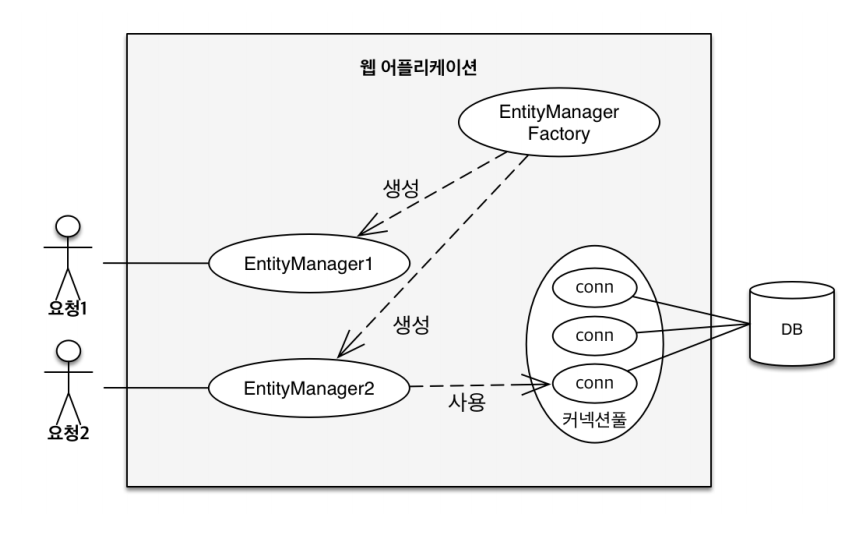
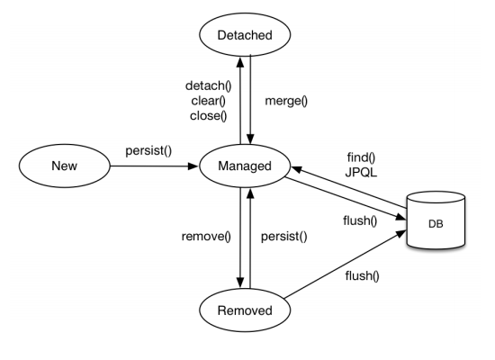
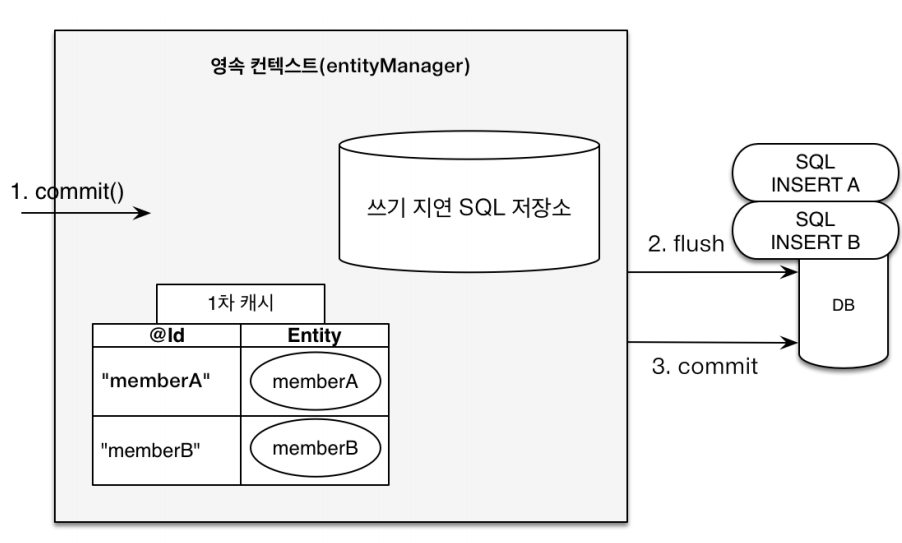
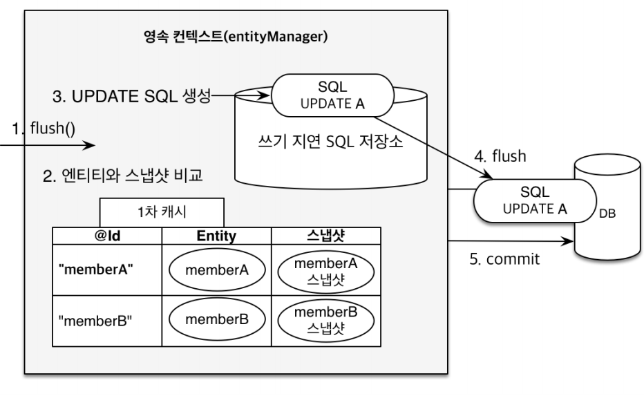
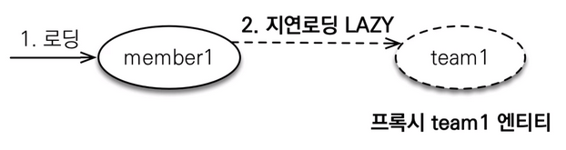

# 03장 영속성 관리



## 영속성 컨텍스트 (PersistenceContext)
```
EntityManager.persist(entity);
```
* 엔티티를 영구 저장하는 환경을 의미한다.
* 논리적인 개념이므로 눈에 보이지 않는다.
* 엔티티 컨텍스트에 접근하려면 `엔티티 매니저`를 이용해야 한다.
* 엔티티를 디비에 저장하는 게 아니라 엔티티 매니저가 영속성 컨텍스트를 관리한다.
* 엔티티 매니저 팩토리는 생성 비용이 크기 때문에 한 애플리케이션에서 공유, 다른 스레드 간 공유 가능
* 앤티티 매니저는 동시성 문제가 있으므로 스레드 간 공유가 금지됨

### 엔티티 매니저
* (J2SE) 엔티티 매니저: 영속성 콘텍스트 = 1:1
* (J2EE, spring) 앤티티 매니저: 영속성 콘텍스트 = N:1

### 엔티티 생명주기


#### 비영속(new/transient)
```
//객체를 생성한 상태(비영속) 
Member member = new Member(); 
member.setId("member1"); 
member.setUsername("회원1");
```
* 영속성 콘텍스트와 전혀 관계가 없는 새로운 상태

#### 영속(managed)
```
//객체를 생성한 상태(비영속) 
Member member = new Member(); 
member.setId("member1"); 
member.setUsername(“회원1”);
EntityManager em = emf.createEntityManager();
em.getTransaction().begin();
//객체를 저장한 상태(영속)
em.persist(member);
```
* 영속성 컨텍스트에 관리되는 상태
* db에 조회해서 1차 캐시에 올라가 있는 것(em.find())도 영속 상태
* jpql 실행 시에도 영속 상태가 됨
* 지금은 1차 캐시를 영속성 콘텍스트라고 이해해도 좋다 (스프링에서는 개념이 달라짐)

#### 준영속(detached)
```
//특정 엔티티를 영속성 컨텍스트에서 분리, 준영속 상태 
em.detach(entity)
// 영속성 컨텍스트를 완전히 초기화
em.claer()
// 영속성 컨텍스트를 종료
em.close() 
```
* 영속성 컨텍스트에 저장되었다가 분리된 상태
* 영속 상태의 엔티티가 영속성 컨텍스트에서 분리된 상태
* 영속성 컨텍스트가 제공하는 기능(더티체킹, 업데이트 등)을 사용할 수 없음
* 커밋을 해도 준영속 상태의 객체는 아무 일도 일어나지 않음

#### 삭제(removed)
```
//객체를 삭제한 상태(삭제) 
em.remove(member);
```
* 삭제된 상태
* 실제로 DB에서 삭제하게 됨
* delete도 트랜잭션이 마무리될 때, 커밋 직전에 수행된다.

### 영속성 컨텍스트의 장점
1. 1차 캐시
   * 1차 캐시는 트랜잭션과 수명을 같이함
   * 성능적 이점을 크게 노리기는 힘듦, 고객 10명이 접근하면 1차 캐시도 10개가 됨
   * 매커니즘을 이해하는 것이 더 중요
   * 비즈니스 로직이 아주 복잡한 경우 도움이 될 수 있음
   ```
   // 엔티티를 생성한 상태 (비영속)
   Member member = new Member();
   member.setId("member1");
   member.setUsername("회원1");
    
   // 엔티티를 영속, 1차 캐시에 저장됨
   em.persist(member);
   
   // 1차 캐시에서 조회
   Member findMember = em.find(Member.class, "member1");
   
   // 1차 캐시에 없다면 DB 조회 후 1차 캐시에 저장해서 반환
   Member findMember2 = em.find(Member.class, "member2");
   ```
2. 동일성(identity) 보장
    ```
    Member a = em.find(Member.class, "member1"); 
    Member b = em.find(Member.class, "member1");
    System.out.println(a == b); //동일성 비교 true
    ```
   * 1차 캐시로 반복 가능한 읽기(repeatable read) 등급의 트랜잭션 격리 수준을 DB가 아닌 애플리케이션 차원에서 제공
   * 위 예제에서 select 쿼리는 1번만 실행됨

3. 트랜잭션을 지원하는 쓰기 지연 (transactional write-behind)
   
    ```
    EntityManager em = emf.createEntityManager();
    EntityTransaction transaction = em.getTransaction();
    
    //엔티티 매니저는 데이터 변경시 트랜잭션을 시작해야 한다.
    transaction.begin(); // 트랜잭션 시작
    em.persist(memberA);
    em.persist(memberB);
    //여기까지 INSERT SQL을 데이터베이스에 보내지 않는다.
    
    //커밋하는 순간 데이터베이스에 INSERT SQL을 보낸다.
    transaction.commit(); // 트랜잭션 커밋
    ```
   * 쓰기 지연을 통해 `버퍼링` 기능을 사용할 수 있음
   * JDBC batch size 만큼 한번에 쿼리를 보낼 수 있음 (하이퍼네이트에서 설정 가능)
   * 배치 프로그램이 아닌 실시간 쿼리에서 얻을 이점이 크진 않음

4. 변경 감지 (dirty checking)
    ```
    EntityManager em = emf.createEntityManager();
    EntityTransaction transaction = em.getTransaction();
    transaction.begin(); // 트랜잭션 시작
    
    // 영속 엔티티 조회
    Member memberA = em.find(Member.class, "memberA");
    
    // 영속 엔티티 데이터 수정
    memberA.setUsername("hi");
    memberA.setAge(10);
    
    //em.update(member) 이런 코드가 있어야 하지 않을까? 답: 필요없음
    transaction.commit(); // 트랜잭션 커밋

    ```
   
   * flush() 가 발생하면 엔티티와 스냅샷 전체를 모두 비교
   * 변경 사항이 있다면 update sql을 생성해서 쓰기 지연 저장소에 넣어둔 후
   * flush로 업데이트 쿼리를 db에 반영한 다음 commit 한다.
   * 즉 set() 이후 따로 update나 persist 해줄 필요 없음


5. 지연 로딩 (lazy loading)

   * 로딩 시점에 lazy 설정이 되어있는 엔티티는 프록시 객체로 가져온다.
   * 실제 객체를 사용하는 시점에 초기화가 되고 db에 쿼리가 나간다.
   * 실무에서 아주 유용한 개념

## 플러시
* 영속성 콘텍스트의 변경내용을 DB에 반영
* 변경 감지 -> 수정된 엔티티 쓰기 지연 SQL 저장소에 등록 -> 쓰기 지연 SQL저장소의 쿼리를 DB에 전송
* 영속성 컨텍스트 내용을 DB에 동기화 하며, 영속성 콘텍스트를 비우지 않음
* `트랜잭션` 작업 단위가 중요하며, 커밋 직전에만 동기화 하면 됨
* (참고) jpa는 동시성에 대한 이슈를 트랜잭션에 위임해서 동작함, 데이터 동기화에 대한 큰 이슈는 없음  
* 플러시가 일어났다고 해서 트랜잭션이 커밋된 것은 아님
* 플러시를 해도 1차 캐시가 사라지지 않음
* 쓰기 지연 SQL 저장소에 쌓였던 쿼리가 DB에 반영되는 과정일 뿐

### 영속성 컨텍스트를 플러시하는 방법
```
// (1) 직접 호출 -- 테스트할 때 주로 사용
em.flush();

// (2) 트랜잭션 커밋 시 플러시 자동 호출
transaction.commit();

// (3) JPQL 쿼리 실행 시 플러시 자동 호출
em.persist(memberA);
em.persist(memberB);
em.persist(memberC);
// 이 상태에서 조회 하면 insert 쿼리가 날아가기 전이기 때문에 조회 안 됨
// 이렇게 엉키는 걸 막기 위해서 JPQL 실행 시 무조건 flush가 호출됨
query = em.createQuery("select m from Member m", Member.class);
List<Member> members= query.getResultList();
```

### 플러시 모드 옵션
```
// 커밋이나 쿼리를 실행할 때 플러시 (기본값) -- 권장
em.setFlushMode(FlushModeType.AUTO)

// 커밋할 때만 플러시 -- 쿼리를 실행할 때는 flush가 안 된다는 뜻, 테스트 시 용이
em.setFlushMode(FlushModeType.COMMIT)
```