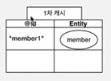
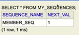

# 04장 엔티티 매핑

JPA에서 가장 중요한 것은 

(1) 영속성 콘텍스트와 내부 동작 방식 같은 메커니즘

(2) 객체와 관계형 데이터를 어떻게 매핑해서 쓰는지와 같은 정적이고 설계적인 측면

## 엔티티 매핑 소개
|종류|매핑 어노테이션|
|:---:|:---:|
|객체와 테이블|**@Entity, @Table**|
|필드와 컬럼|**@Column**|
|기본 키|**@Id**|
|연관관계|**@ManyToOne, @JoinColumn**|

## 객체와 테이블 매핑

### @Entity
* @Entity가 붙은 클래스는 JPA가 관리한다.
* JPA를 사용해서 테이블과 매핑할 클래스는 @Entity가 필수이다.
* JPA 스펙상 기본 생성자가 필수이다. (파라미터가 없는 public, protected 생성자)
* final 클래스, enum, interface, inner 클래스는 매핑해서 사용 불가하다.
* DB에 저장할 필드에 final을 사용하지 않는다.
* name 속성을 통해 JPA에서 사용할 엔티티 이름을 지정한다.
* 기본값은 클래스 이름을 그대로 사용한다.

```java
// JPA가 관리하는 클래스며 데이터베이스와 매핑된다.
@Entity (name="Member")
```

### @Table
* 엔티티와 매핑할 테이블을 지정
```java
@Table(name="mbr")
```
| 속성 | 기능 | 기본값 |
|:---:|:---:|:---:|
| name | 매핑할 테이블 이름 | 엔티티 이름을 사용 |
| catalog | 데이터베이스 catalog 매핑 | |
| schema | 데이터베이스 schema 매핑 | |
| uniqueConstraints(DDL) | DDL 생성 시에 유니크 제약 조건 생성 | |

## 데이터베이스 스키마 자동 생성

* JPA는 어플리케이션 로딩 시점에 DB 테이블을 생성하는 기능도 제공함 
    * 운영에서는 사용하면 안 됨
    * 로컬에서 테스트할 때 유용할 수 있음
    * **이렇게 생성된 DDL은 개발 장비에서만 사용**
* 데이터베이스 dialect를 활용해서 데이터베이스에 맞는 적절한 DDL 생성
* 테이블이 아닌 객체 중심으로 개발 가능
* 생성된 DDL은 운영서버에서는 사용하지 않거나, 적절히 다듬은 후 사용

```xml
// persistence.xml 에 속성 추가
<property name="hibernate.hbm2ddl.auto" value="create" />
```
* JPA가 알아서 동일한 이름의 테이블이 있으면 지우고 새로 생성
* 데이터베이스 dialect별로 다르게 쿼리 생성 (varchar 등)

| 옵션(value) | 설명 |
|:---:|:---:|
|create |기존테이블 삭제 후 다시 생성 (DROP + CREATE)|
|create-drop | create와 같으나 종료시점에 테이블 DROP|
|update | 변경분만 반영(운영DB에는 사용하면 안됨)|
|validate  | 엔티티와 테이블이 정상 매핑되었는지만 확인|
|none |사용하지 않음|

* create-drop은 테스트케이스 실행 후 깔끔히 지우고 싶을 때 사용
* update는 기존의 테이블에 새로 추가된 필드를 추가(alter와 동일), 지우는 건 불가
* validate는 테이블과 엔티티가 정상 매핑되었는지 확인해 줌 (다르다면 에러 로그 출력)
* none은 기능을 비활성화, 사실 아무것도 안 적은 것과 동일, 라인을 통째로 주석처리해도 됨

### 주의
* **운영 장비에는 절대 create, create-drop, update 사용하면 안 된다.**
* 개발 초기 단계에는 create 또는 update (로컬)
* 테스트 서버에는 update 또는 validate (여러명이 사용하는 테스트 서버)
  * 하지만 update도 가급적이면 쓰지 말 것
  * 어플리케이션이 구동되는 시간이 길어짐
  * 쿼리 스크립트를 직접 짜서 테스트 해보고 검토를 받은 후 쓰거나, 아예 쓰지 말기
  * create는 drop이 선행되므로 매우 위험하며 운영에서 절대 쓰지 말 것
  * alter 테이블이 잘 못 되면 데이터베이스가 통째로 lock 걸려서 서비스가 멈춤
  * 근본적 해결책은 웹 어플레케이션의 alter나 drop 가능 계정을 분리해야함  
* 스테이징과 운영 서버는 validate 또는 none (절대 쓰면 안 됨)

### DDL 생성 기능
```jql
// 제약조건 추가: 회원 이름은 필수, 10자 초과 X
@Column(nullable = false, length = 10) 

// 유니크 제약조건 추가 -- 
@Table(uniqueConstraints = {@UniqueConstraint( name = "NAME_AGE_UNIQUE",
 columnNames = {"NAME", "AGE"} )}) 
```
* DDL 생성 기능은 DDL을 자동 생성할 때만 사용되고 JPA의 실행 로직에는 영향을 주지 않는다 
* 애플리케이션이 아닌 데이터베이스에만 영향을 줌 (스크립트가 한번 더 실행될 뿐)
* length는 validation 하는 경우도 있음

## 필드와 컬럼 매핑
요구사항
1. 회원은 일반 회원과 관리자로 구분해야 한다.
2. 회원 가입일과 수정일이 있어야 한다.
3. 회원을 설명할 수 있는 필드가 있어야 한다. 이 필드는 길이 제한이 없다.


```java
package hellojpa;

import javax.persistence.*;
import java.util.Date;

@Entity
public class Member {

    @Id
    private Long id;

    @Column(name = "name")
    private String username;

    private Integer age;

    // DB에는 Enum이 없으므로 @Enumerated 어노테이션이 필수
    @Enumerated(EnumType.STRING)
    private RoleType roleType;

    // DB의 TIMESTAMP는 date, time, timestamp로 분류됨
    @Temporal(TemporalType.TIMESTAMP)
    private Date createdDate;

    @Temporal(TemporalType.TIMESTAMP)
    private Date lastModifiedDate;

    // varchar를 넘어서는 큰 데이터를 넣을 때 @Lob 사용
    @Lob
    private String description;

    public Member() {

    }

    public Long getId() {
        return id;
    }

    public void setId(Long id) {
        this.id = id;
    }

    public String getUsername() {
        return username;
    }

    public void setUsername(String username) {
        this.username = username;
    }

    public Integer getAge() {
        return age;
    }

    public void setAge(Integer age) {
        this.age = age;
    }

    public RoleType getRoleType() {
        return roleType;
    }

    public void setRoleType(RoleType roleType) {
        this.roleType = roleType;
    }

    public Date getCreatedDate() {
        return createdDate;
    }

    public void setCreatedDate(Date createdDate) {
        this.createdDate = createdDate;
    }

    public Date getLastModifiedDate() {
        return lastModifiedDate;
    }

    public void setLastModifiedDate(Date lastModifiedDate) {
        this.lastModifiedDate = lastModifiedDate;
    }

    public String getDescription() {
        return description;
    }

    public void setDescription(String description) {
        this.description = description;
    }
}

```

실행 결과

```
Hibernate: 
    
    drop table Member if exists
Hibernate: 
    
    create table Member (
       id bigint not null,
        age integer,
        createdDate timestamp,
        description clob,
        lastModifiedDate timestamp,
        roleType varchar(255),
        name varchar(255),
        primary key (id)
    )
```
* bitint이라는 데이터타입이 있음
* lob으로 어노테이션 해놓은 필드가 문자타입이면 clob으로 생성됨
* enum과 name은 varchar로 매핑됨

### 매핑 어노테이션
|어노테이션 |설명|
|:---:|:---:|
|@Column |컬럼 매핑|
|@Temporal |날짜 타입 매핑|
|@Enumerated | enum 타입 매핑|
|@Lob |BLOB, CLOB 매핑|
|@Transient| 특정 필드를 컬럼에 매핑하지 않음(매핑 무시)|

### @Column 설명
|속성 |설명 |기본값|
|:---:|:---:|:---:|
|name 필드와 매핑할 테이블의 컬럼 이름| 객체의 필드 이름|
|insertable,updatable | 필드 추가, 변경 후 데이터베이스에 등록, 변경 가능 여부 |TRUE|
|nullable(DDL) |null 값의 허용 여부를 설정한다. false로 설정하면 DDL 생성 시에 not null 제약조건이 붙는다.| |
|unique(DDL) | @Table의 uniqueConstraints와 같지만 한 컬럼에 간단히 유니크 제약조건을 걸 때 사용한다.| |
|columnDefinition(DDL) | 데이터베이스 컬럼 정보를 직접 줄 수 있다. ex) varchar(100) default ‘EMPTY' | 필드의 자바 타입과 방언 정보를 사용해서 적절한 컬럼 타입 
| length(DDL) |문자 길이 제약조건, String 타입에만 사용한다. |255|
| precision, scale(DDL) | BigDecimal 타입에서 사용한다(BigInteger도 사용할 수 있다). precision은 소수점을 포함한 전체 자 릿수를, scale은 소수의 자릿수 다. 참고로 double, float 타입에는 적용되지 않는다. 아주 큰 숫자나 정 밀한 소수를 다루어야 할 때만 사용한다. | precision=19, scale=2 |
* `unique`는 단일 칼럼에서만 사용 시 constraint 이름이 알아보기 힘들게 나오므로, `@Table(uniqueConstraints = )`로 이름까지 주는 것을 권장
* `columnDefinition`은 특정 디비에 종속적인 옵션을 구체적으로 전달할 수 있음

### @Enumerated
* 자바 enum 타입을 매핑할 때 사용 
  * EnumType.ORDINAL: enum 순서를 데이터베이스에 저장
  * EnumType.STRING: enum 이름을 데이터베이스에 저장
* `ordinal`이 기본값인데 사용하지 말 것!! 왜냐면 Enum이 추가되고 DB 업데이트 시 복구 불가능하게 꼬일 수 있음 (마이그레이션 해야함..)

### @Temporal
* 날짜 타입(java.util.Date, java.util.Calendar)을 매핑할 때 사용
    * TemporalType.DATE: 날짜, 데이터베이스 date 타입과 매핑
      (예: 2013–10–11)
    * TemporalType.TIME: 시간, 데이터베이스 time 타입과 매핑
      (예: 11:11:11)
    * TemporalType.TIMESTAMP: 날짜와 시간, 데이터베이스 timestamp 타입과 매핑
      (예: 2013–10–11 11:11:11)
* 참고: LocalDate(연월), LocalDateTime(연월일)을 사용할 때는 생략 가능(최신 하이버네이트 지원)
    ```java
    // 어노테이션 주지 않아도 각각 date와 timestamp로 알아서 들어감
    private LocalDate testLocalDate;
    private LocalDateTime testLocalDateTime;
  ```

### @Lob
* 데이터베이스 BLOB, CLOB 타입과 매핑
    * @Lob에는 지정할 수 있는 속성이 없다.
    * 매핑하는 필드 타입이 문자면 CLOB 매핑, 나머지는 BLOB 매핑
    * CLOB: String, char[], java.sql.CLOB
    * BLOB: byte[], java.sql. BLOB

### @Transient
* 필드 매핑X
    * 데이터베이스에 저장X, 조회X
    * 주로 메모리상에서만 임시로 어떤 값을 보관하고 싶을 때 사용
```
@Transient
private Integer temp;
```

## 기본 키 매핑 
* 직접 할당 @Id
* 자동 할당 @GenerateValue
  * IDENTITY: 데이터베이스에 위임, MYSQL
  * SEQUENCE: 데이터베이스 시퀀스 오브젝트 사용, ORACLE 
    * @SequenceGenerator 필요
  * TABLE: 키 생성용 테이블 사용, 모든 DB에서 사용
    * @TableGenerator 필요
  * AUTO: 방언에 따라 위의 3값 중에서 하나로 자동 지정, 기본값

### Identity
```java
@Entity
@GeneratedValue(strategy = GenerationType.IDENTITY)
```
* 기본 키 생성을 데이터베이스에 위임
* 주로 MySQL, PostgreSQL, SQL Server, DB2에서 사용 (예: MySQL의 AUTO_ INCREMENT)


* id에 값을 넣지 않아서 null 인 상태로 전달되면 DB에서 알아서 값을 넣어줌
* 즉, 값을 알게 되는 시점이 DB에 넣는 순간임
* 영속성 관리가 되려면 PK 값을 알아야되므로, identity 전략은 제약이 생김

> IDENTITY 전략은 **em.persist() 시점에 즉시 INSERT SQL 실행**하고 DB에서 식별자를 조회
* JPA는 보통 트랜잭션 커밋 시점에 INSERT SQL 실행
* AUTO_ INCREMENT는 데이터베이스에 INSERT SQL을 실행한 이후에 ID 값을 알 수 있음
> IDENTITY 전략에서는 모아서 insert 하는 것이 불가능

### Sequence
* 데이터베이스 시퀀스는 유일한 값을 순서대로 생성하는 특별한 데이터베이스 오브젝트(예: 오라클 시퀀스)
* 오라클, PostgreSQL, DB2, H2 데이터베이스에서 사용
* id 타입은 string은 안 되고, integer는 길이가 애매해서 long을 써는 것을 권장

```java
@Entity 
@SequenceGenerator( 
 name = “MEMBER_SEQ_GENERATOR", 
 sequenceName = “MEMBER_SEQ", //매핑할 데이터베이스 시퀀스 이름
 initialValue = 1, allocationSize = 1) 
public class Member { 
 @Id 
 @GeneratedValue(strategy = GenerationType.SEQUENCE, generator = "MEMBER_SEQ_GENERATOR") 
 private Long id; 
```

* `em.persist(member)`를 하려면 무조건 PK가 필요함
* 그래서 시퀀스 전략일 때는 애플리케이션이 DB의 member_sequence에서 id 값을 가져옴 (현재 값)
* 아직 영속성 컨텍스트에 들어가지는 않은 상태, 커밋할 때 insert 쿼리가 진행
* 즉, 시퀀스 전략에서는 쭉 모아서 한번에 트랜잭션 처리가 가능함

| 속성 | 설명 | 기본값 | 
|:---:|:---:|:---:|
| name | 식별자 생성기 이름 | 필수 |
| sequenceName | 데이터베이스에 등록되어 있는 시퀀스 이름 | hibernate_sequence |
| initialValue | DDL 생성 시에만 사용됨, 시퀀스 DDL을 생성할 때 처음 1 시작하는 수를 지정한다 | 1 |
|allocationSize| 시퀀스 한 번 호출에 증가하는 수(성능 최적화에 사용됨) 데이터베이스 시퀀스 값이 하나씩 증가하도록 설정되어 있으면 이 값을 반드시 1로 설정해야 한다 | 50 |
| catalog, schema | 데이터베이스 catalog, schema 이름| |


#### 이게 성능상 이슈가 있진 않을까? - sequence 전략의 성능 최적화
* `allocationSize` 이라는 속성이 있음 (기본값 = 50)
* 네트워크를 여러번 타면 성능 저하가 발생할 수 있으니까 처음부터 50개를 세팅해놓고, 메모리를 1씩 사용
* 만약 50에 도달했다면 `call next value`를 호출해서 100까지 재할당
* 이를 사용하면 여러 웹서버가 있어도 동시성 이슈가 없이 해결할 수 있음

#### call next value 실습해보기

* 최초로 em.persiste를 하면 call next value가 2번 호출됨
* 시퀀스가 최초 1로 만들어지고 50씩 증가됨 (1->51->101 순서로 증가)
* 한번 호출했을 때 1이 되도록 하기 위해서 최초값은 `-49`로 설정되어 있음
* 최초로 한번 호출하면 1이 되지만, 성능 최적화를 위해 51까지 메모리를 늘려놔야하므로 call next value가 2번 호출됨
```java
em.persist(member1); // 직접 호출 - 1, 51
em.persist(member2); // memory - 2, 51
em.persist(member3); // memory - 3, 51

```


### Table 전략
* 키 생성 전용 테이블을 하나 만들어서 데이터베이스 시퀀스를 흉내내는 전략
* 장점: 모든 데이터베이스에 적용 가능
* 단점: 테이블을 직접 사용하다보니 락이 걸릴수도 있고, 최적화가 안 되서 성능 이슈가 있음
* 운영에서 쓰기는 조금 부담스러울 수 있으므로 DB에서 관례적으로 쓰는 것을 사용하길 권장
```java
// Member.java
@Entity 
@TableGenerator( 
 name = "MEMBER_SEQ_GENERATOR", 
 table = "MY_SEQUENCES", 
 pkColumnValue = “MEMBER_SEQ", allocationSize = 1) 
public class Member { 
 @Id 
 @GeneratedValue(strategy = GenerationType.TABLE, // 매핑전략을 table로 잡음
 generator = "MEMBER_SEQ_GENERATOR") 
 private Long id; 
```
실행 결과
```java
create table MY_SEQUENCES ( 
 sequence_name varchar(255) not null, 
 next_val bigint, 
 primary key ( sequence_name ) 
)
```


#### @TableGenerator 속성
|속성 |설명| 기본값|
|:---:|:---:|:---:|
|name |식별자 생성기 이름 |필수|
|table |키생성 테이블명| hibernate_sequences|
|pkColumnName |시퀀스 컬럼명 |sequence_name|
|valueColumnName |시퀀스 값 컬럼명| next_val|
|pkColumnValue |키로 사용할 값 이름 |엔티티 이름|
|initialValue |초기 값, 마지막으로 생성된 값이 기준이다.| 0|
|allocationSize |시퀀스 한 번 호출에 증가하는 수(성능 최적화에 사용됨) |50|
|catalog, schema |데이터베이스 catalog, schema 이름||
|uniqueConstraints(DDL) |유니크 제약 조건을 지정할 수 있다.||
* initailValue와 allocationSize는 최적화와 관련

### 권장하는 식별자 전략
* **기본 키 제약 조건**: null 아님, 유일, **변하면 안된다.**
* 미래까지 이 조건을 만족하는 자연키(전화번호, 주민번호 등 비즈니스와 유관한 키)는 찾기 어렵다. 대리키(대체키-비즈니스와 무관한 키)를 사용하자.
* **권장: Long형 + 대체키(시퀀스, 유일아이디 등) + 키 생성전략 사용**
* auto_increment나 sequence 혹은 사내 제너레이션 룰을 사용하기

## 예제1 - 요구사항 분석과 기본 매핑
