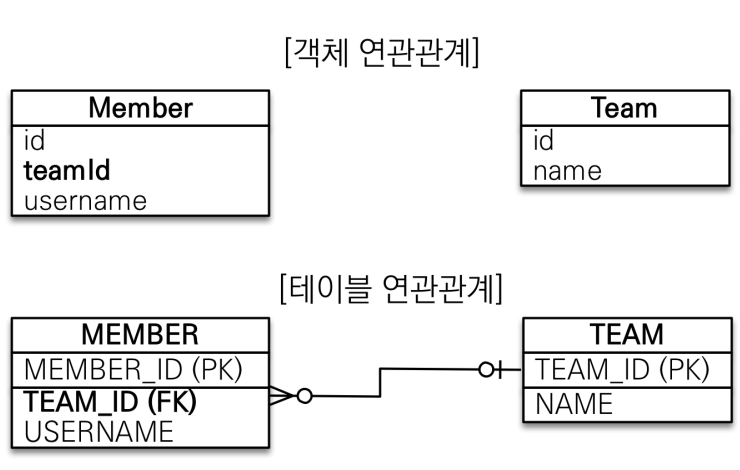
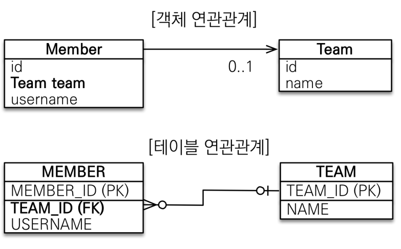
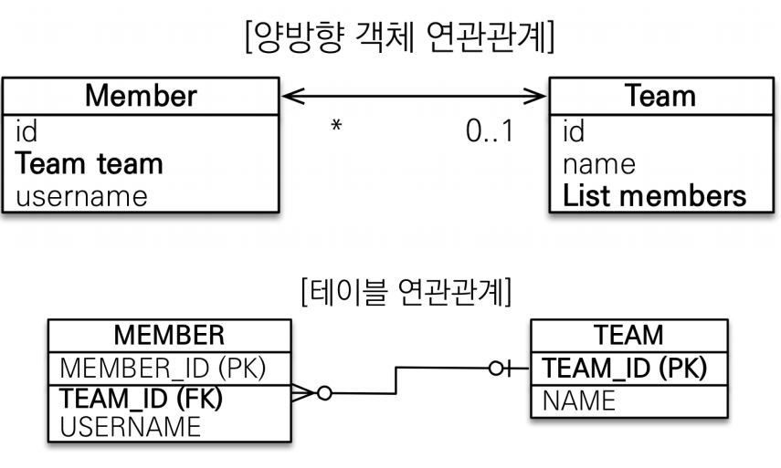
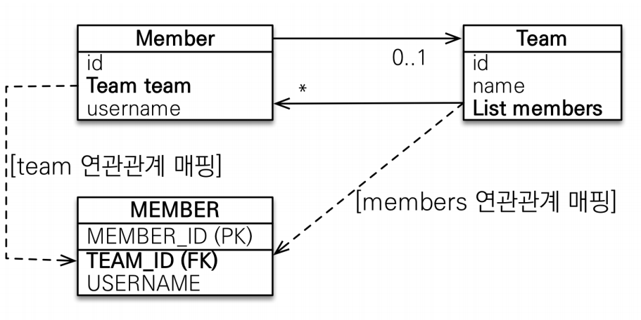
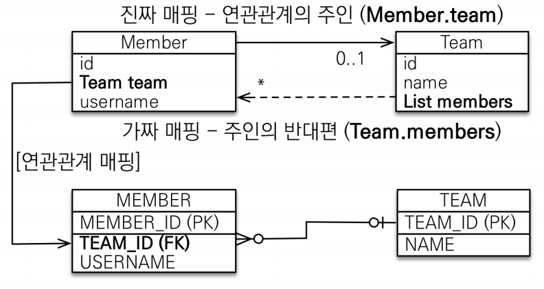

# 05장 연관관계 매핑

> 관계형 DB 패러다임을 버리고 객체지향 설계를 적용하기 위한 첫 단계

## 목표
* 객체와 테이블 연관관계의 차이를 이해하는 것이 우선된다.
* [핵심] 객체의 참조와 테이블의 외래 키(DB)를 어떻게 매핑할지 배운다.

## 용어 이해
* 방향(Direction)
  * 단방향 - 객체는 단방향을 양쪽으로 걸어서 양방향 구현
  * 양방향 - 테이블은 항상 양방향이므로 방향 개념이 없음
* 다중성(Multiplicity)
  * 다대일(N:1)
  * 일대다(1:N)
  * 일대일(1:1)
  * 다대다(N:M) 이해
* 연관관계의 주인(Owner) ⭐
  * 객체 양방향 연관관계는 관리 주인이 필요


## 단방향 연관관계
### 예제 시나리오
* 회원과 팀이 있다.
* 회원은 하나의 팀에만 소속될 수 있다.
* 회원과 팀은 다대일 관계다.

### (1) 데이터 중심 설계


```java
/* SQL 종속적 설계 방식 */
/* 객체를 테이블에 맞추어 데이터 중심으로 모델링하면, 협력 관계를 만들 수 없다.
*  [데이터중심] 테이블은 외래 키로 조인을 사용해서 연관된 테이블을 찾는다.
*  [객체 중심] 객체는 참조를 사용해서 연관된 객체를 찾는다.
*  테이블과 객체 사이에는 이런 큰 간격이 있다. */

// 구조
@Entity
public class Member {

    @Id @GeneratedValue
    @Column(name = "MEMBER_ID")
    private Long id;

    @Column(name = "USERNAME")
    private String username;

    @Column(name = "TEAM_ID")
    private Long teamId;
}
    
    
// 생성
    Team team = new Team();
    team.setName("TeamA");
    em.persist(team);

    Member member = new Member();
    member.setUsername("member1");
    member.setTeamId(team.getId());
    em.persist(member);

//조회 - 매번 jpa에게 pk를 물어보는 과정이 번잡스러움
    Member findMember = em.find(Member.class, member.getId());
    Long findTeamId = findMember.getTeamId();
    Team findTeam = em.find(Team.class, findTeamId);
```

### (2) 객체 지향 설계


```java
// 구조
@Entity
public class Member {

    @Id @GeneratedValue
    @Column(name = "MEMBER_ID")
    private Long id;

    @Column(name = "USERNAME")
    private String username;

    @ManyToOne // FetchType.LAZY를 주면 쿼리가 분리되서 나감 (지연로딩 전략)
    @JoinColumn(name = "TEAM_ID") // db 입장에서 어떤 컬럼과 연결할지 명시
    private Team team;
    
// 생성
    Team team = new Team();
    team.setName("TeamA");
    em.persist(team);

    Member member = new Member();
    member.setUsername("member1");
    member.setTeam(team);
    em.persist(member);
    
// 조회
    Member findMember = em.find(Member.class, member.getId());
    Team findTeam = findMember.getTeam();
    System.out.println("fineTeam = " + findTeam.getName()); // 영속성 콘텍스트가 적용되므로 1차 캐시에서 가져옴

// 멤버의 소속 팀 수정 코드
    Team newTeam = em.find(Team.class, 100L);
    findMember.setTeam(newTeam);
```

## 양방향 연관관계와 연관관계의 주인
### 객체와 테이블이 각각 관계를 맺는 방법
* 객체 연관관계 = 2개 // 양쪽에 서로를 찾을 수 있는 객체 추가해줘야 함
    * 회원 -> 팀 연관관계 1개(단방향)
    * 팀 -> 회원 연관관계 1개(단방향)
* 테이블 연관관계 = 1개 // PK와 FK로 조인 가능하므로 방향 개념이 없음
    * 회원 <-> 팀의 연관관계 1개(양방향)
    

```java
// 구조
@Entity
public class Member {

    @Id @GeneratedValue
    @Column(name = "MEMBER_ID")
    private Long id;

    @Column(name = "USERNAME")
    private String username;

    @ManyToOne // FetchType.LAZY를 주면 쿼리가 분리되서 나감 (지연로딩 전략)
    @JoinColumn(name = "TEAM_ID") 
}

public class Team {

    @Id @GeneratedValue
    @Column(name = "TEAM_ID")
    private Long id;
    private String name;

    @OneToMany(mappedBy = "team") // 1:n 매핑에서 n이 무엇인지 명시
    private List<Member> member = new ArrayList<>();
 }
    
// 생성
    Team team = new Team();
    team.setName("TeamA");
    em.persist(team);

    Member member = new Member();
    member.setUsername("member1");
    member.setTeam(team);
    em.persist(member);
    
// 1차 캐시가 아니라 DB에서 바로 테스트
    em.flush();
    em.clear();
    

// 팀 리스트 조회
    List<Member> members = findMember.getTeam().getMember();
    for(Member m : members){
        System.out.println("m = " + m.getUsername());
    }
```

### mappedBy란?
* 외래키 하나로 연관관계를 맺는 테이블 (방향 개념이 아예 없음)
* 양방향 객체 연관관계는 `단방향 연관관계`를 **2개** 만들어서 양쪽에 참조를 둠


* 특정 멤버의 팀을 바꾸고 싶을 때 team과 list members 중에서 뭘 업데이트 해줘야 하나?
* 테이블 입장에서는 FK만 업데이트해주면 됨
> 둘 중 하나를 주인으로 설정하자!

### 연관관계의 주인(Owner) 매핑 규칙
* 객체의 두 관계중 하나를 연관관계의 주인으로 지정
* **연관관계의 주인만이 외래 키를 관리(등록, 수정)**
* 주인이 아닌쪽은 읽기만 가능
* 주인은 mappedBy 속성 사용X
* 주인이 아니면 `mappedBy` 속성으로 주인 지정

### 누구를 주인으로?
> 외래키가 있는 곳을 주인으로 정하라, 즉 1:n 중 n을 주인으로 정하라
* 인지하기 쉽고, 성능면에서 낫기 때문
* 비즈니스 로직을 기준으로 연관관계 주인을 선택하면 안 됨


* 예제에서는 Member.team이 연관관계의 주인

## 주의점
* 연관관계의 주인은 Member.team
* team에 있는 members 리스트는 읽기 전용 
  * jpa에서 수정이나 삽입할 때 전혀 고려하지 않음 가짜 매핑
  
```java
/* 코드1 */
// 이 예제는 member와 team을 각각 insert
// 그러나 member 테이블의 team_id FK가 업데이트 되지 않음

Member member = new Member();
member.setUsername("member1");
em.persist(member);

Team team = new Team();
team.setName("TeamA");
team.getMembers().add(member); // JPA가 반영하지 않는 코드
em.persist(team);
```

* team.getMembers().add(member); 는 JPA가 반영하지 않는 코드
* 역방향(주인이 아닌 방향)만 연관관계를 설정하면 DB에 반영되지 않음

```java
/* 코드2 */
// 이 예제는 team과 member를 각각 insert
// member 테이블의 team_id FK가 업데이트 됨

Team team = new Team();
team.setName("TeamA");
em.persist(team);

Member member = new Member();
member.setUsername("member1");
member.setTeam(team); // FK 업데이트
em.persist(member);

team.getMembers().add(member); // JPA가 반영하지 않는 코드
```
* 연관관계 주인에 값을 입력하면 정상적으로 동작
* 하지만 순수한 객체 관계를 고려하면 양쪽에 모두 입력하는 것이 이상적
* 또한 영속성 콘텍스트에 올라간 컬렉션이 깨끗한 순수 객체 상태라서 조인 조회 쿼리가 동작하지 않음  
  * em.flush를 안 하고 1차 캐시만 조회할 때, members 조회 쿼리가 동작하지 않음
  * team이 그대로 영속 콘텍스트에 올라가 있고 그걸 조회했을 때 컬렉션에 아무 값이 없음
* 테스트케이스 작성 시 JPA 없이 동작하도록 작성하므로 이때를 대비해 양방향으로 넣을 필요가 있음


### 양방향 연관관계 실습
* 주인이 아닌 객체에도 연관관계를 맺어줄 것
* 하지만 main에 작성하는 코드는 까먹기 쉬움
```java
// jpa 입장에서는 의미 없는 중복 코드지만, 항상 넣어주는 게 필요
team.getMembers().add(member);
```

* 양방향 매핑을 잊지 않기 위해서 `연관관계 편의 메소드`를 작성하자
* setter에서 미리 연관관계 맺어주기
* setter를 굳이 안 써도 된다면 `changeTeam` 처럼 쉽게 이해 가능한 메소드 만들어주기
* 편의 메소드는 2개가 있으면 무한 루프가 생길 수 있으므로 1개만 사용하기
```java
// Member.java
public void changeTeam(Team team) {
        this.team = team;
        team.getMembers().add(this);
    }

// Team.java    
public void addMember(Member member) {
        member.setTeam(this);
        members.add(member);
    }
```
* 무한 루프는 toString(), lombok, JSON 생성 라이브러리에서도 발생 가능 (StackOverflowError)
* 실무에서는 controller에서 entity를 반환하지 말 것, DTO로 바꿔서 반환할 것

## 정리
* **실무에서는 먼저 단방향 매핑으로 설계를 끝내라**
* 객체 관점에서 양방향 매핑을 이후에 추가하라 (객체 그래프 탐색 - 조회 기능)
* 왜 양방향을 굳이 해주나? (1) 영속성 콘텍스트 (2) 생각보다 JPQL에서 역방향으로 탐색할 일이 많음
* 단방향 매핑을 잘 해두고 양방향은 필요할 때마다 추가해나가면 됨 (어차피 테이블은 바뀌지 않으므로)